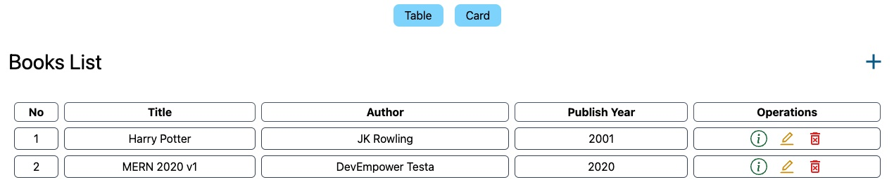
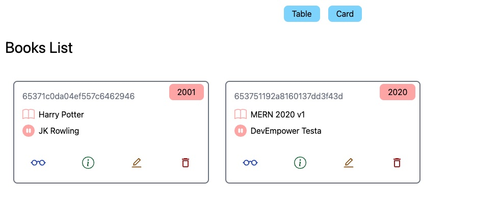

# MERN - Books List

A full stack books list application with CRUD functionality.

Deployed link: http://mern-books.netlify.app
Note that it can take up to 1 minute to retrieve the backend database

## Demo & Snippets

Books - table view

Books - cards view

---

## Stack

-   Front end: Vite, React, JavaScript, Tailwind CSS
    -   Front end dependencies include:
        -   axios
        -   react-router-dom
        -   react-icons
    -   Front end hosted on netlify
-   Back end: Express. Hosted on render. Backend API via [API](https://mern-books-yw7a.onrender.com/books)
-   Database: MongoDB

---

## Build Steps on local machine

-   Run backend server, by cd into the backend folder, then running `npm run dev`
-   Run frontend server, by cd into frontend folder, then running `npm run dev`

---

## Features

-   The project is a working full stack application to add, modify and delete books from a mongoDB cloud-hosted database
